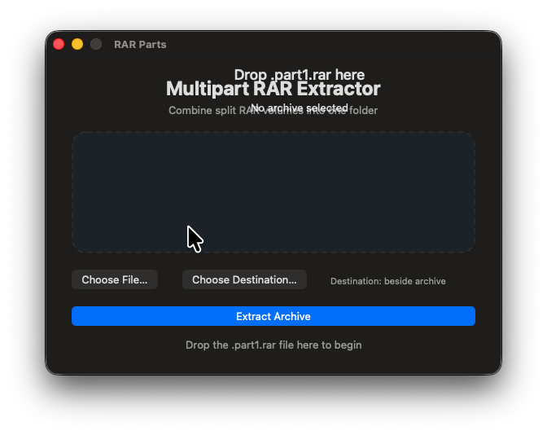

# RARParts

A simple macOS utility that extracts multipart RAR archives as one archive while preserving the original folder structure.

Select or drag in `archive.part1.rar`; RARParts detects the remaining volumes and extracts them together.

## Download

Download `RARParts-Installer.dmg` from the repository's Releases page. Open it and drag `RARParts` into Applications.

The included build is for Apple Silicon Macs. macOS may display a first-open security warning because the app is not notarized.

## Build from source

Install the extractor once:

```sh
brew install unar
```

Then build the standalone app:

```sh
./build-standalone-app.command
open RARParts.app
```

For the Python command-line utility:

```sh
python3 rar_parts_extract.py "/path/to/archive.part1.rar"
```

Or drag the `.part1.rar` file onto `extract-rar-parts.command` in Finder. The default destination is a folder beside the archive. Use `--output` to choose another folder.

## Graphical app

Build the simple native macOS interface with:

```sh
swiftc RARPartsApp.swift -o RARParts
open RARParts
```

The app supports drag-and-drop, file selection, destination selection, and one-click extraction. The standalone app bundles its own `unar` executable and does not require Homebrew or Python on the receiving Mac.

## Licensing

RARParts source code is released under the MIT License. The bundled `unar` extraction engine is from [The Unarchiver / XADMaster](https://github.com/MacPaw/XADMaster) and remains under its LGPL-2.1-or-later license. See `RARParts.app/Contents/Resources/UNAR-LICENSE`.

## Acknowledgement

Built with help from OpenAI Codex in ChatGPT as a practical Mac alternative to WinRAR's multipart extraction workflow.



Always select or drag **part1**. The utility automatically finds the consecutive volumes beside it and extracts through the first volume, allowing the extractor to join all parts.
